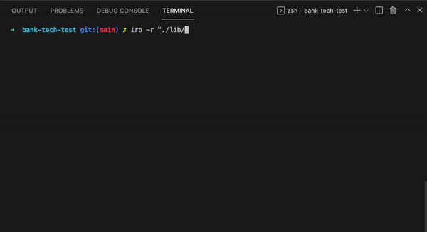

Bank Tech Test
💸💸💸💸💸
=================

Simulation of a banking system (specification below), which runs in the terminal via IRB (Interactive Ruby Shell in the command line).

The purpose in order to demonstrate high quality code which follows best practice OOP principles (e.g. is SOLID and DRY). The purpose of this exercise was to write high quality code which is developed using a TDD approach. 

### Technologies used
- Language: Ruby
- Testing: Rspec
- Linter: Rubocop
- Code Coverage: SimpleCov(100% test coverage)

 

### Getting started
```
git clone git@github.com:eds-101/bank-tech-test.git
cd bank-tech-test
bundle  #install dependencies
```
### Usage
```
irb -r "./lib/bank.rb"  #start IRB

bank = Bank.new         #create new Bank instance
bank.deposit(1000)      #deposit money
bank.withdraw(50)       #withdraw money
bank.print_statement    #view bank statement
```

### Running tests
```
rspec
```

### My dev notes
* Dependency injection for the Bank's print_statement method, in order to preserve flexibility in the code
* Added guards for the Bank's deposit and withdraw methods in order to make sure input was a number, so the input could be controlled and avoid accidental bugs.


* How to pass the acceptance criteria:
```sh
Run `rspec` from the command line to see the passing feature test
```

## Specification (from Makers Academy)

### Requirements

* You should be able to interact with your code via a REPL like IRB or the JavaScript console.  (You don't need to implement a command line interface that takes input from STDIN.)
* Deposits, withdrawal.
* Account statement (date, amount, balance) printing.
* Data can be kept in memory (it doesn't need to be stored to a database or anything).

### Acceptance criteria

**Given** a client makes a deposit of 1000 on 10-01-2012  
**And** a deposit of 2000 on 13-01-2012  
**And** a withdrawal of 500 on 14-01-2012  
**When** she prints her bank statement  
**Then** she would see

```
date || credit || debit || balance
14/01/2012 || || 500.00 || 2500.00
13/01/2012 || 2000.00 || || 3000.00
10/01/2012 || 1000.00 || || 1000.00
```
