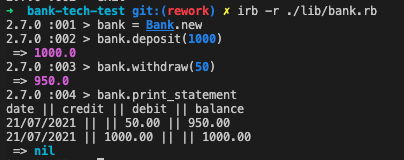

Bank Tech Test
=================

The purpose of this exercise was to write high quality code. It was written using TDD and meets the requirements and accceptance criteria with 100% test coverage.

The program was written in Ruby and tested with Rspec, see below for instructions on how to run both.




# Notes
* I used a dependency injection for the Bank's print_statement method, in order to preserve flexibility in the code
* I added guards for the Bank's deposit and withdraw methods in order to make sure input was a number, so the input could be controlled and avoid accidental bugs.

* How to install and run the program:
```sh
$ git clone git@github.com:makersacademy/bank-tech-test.git
Use your terminal, navigate to root of this project root folder and run the following commands
$ cd lib
$ bundle
$ irb
$ require "./bank.rb"
$ bank = Bank.new
$ bank.deposit(1000)
$ bank.withdraw(50)
$ bank.print_statement
```
* How to run tests:
```sh
Use your terminal and navigate to root of this project root folder
$ rspec
```

* How to pass the acceptance criteria:
```sh
Run `rspec` from the command line to see the passing feature test
```

## Specification

### Requirements

* You should be able to interact with your code via a REPL like IRB or the JavaScript console.  (You don't need to implement a command line interface that takes input from STDIN.)
* Deposits, withdrawal.
* Account statement (date, amount, balance) printing.
* Data can be kept in memory (it doesn't need to be stored to a database or anything).

### Acceptance criteria

**Given** a client makes a deposit of 1000 on 10-01-2012  
**And** a deposit of 2000 on 13-01-2012  
**And** a withdrawal of 500 on 14-01-2012  
**When** she prints her bank statement  
**Then** she would see

```
date || credit || debit || balance
14/01/2012 || || 500.00 || 2500.00
13/01/2012 || 2000.00 || || 3000.00
10/01/2012 || 1000.00 || || 1000.00
```
